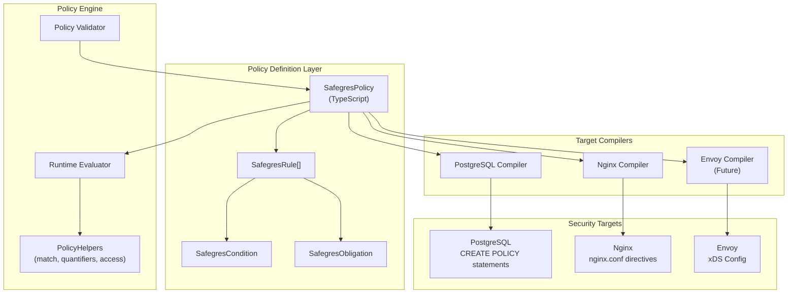
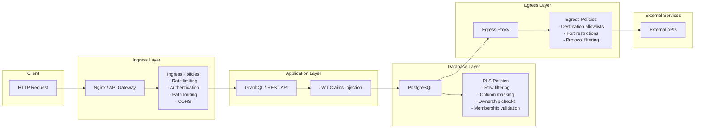
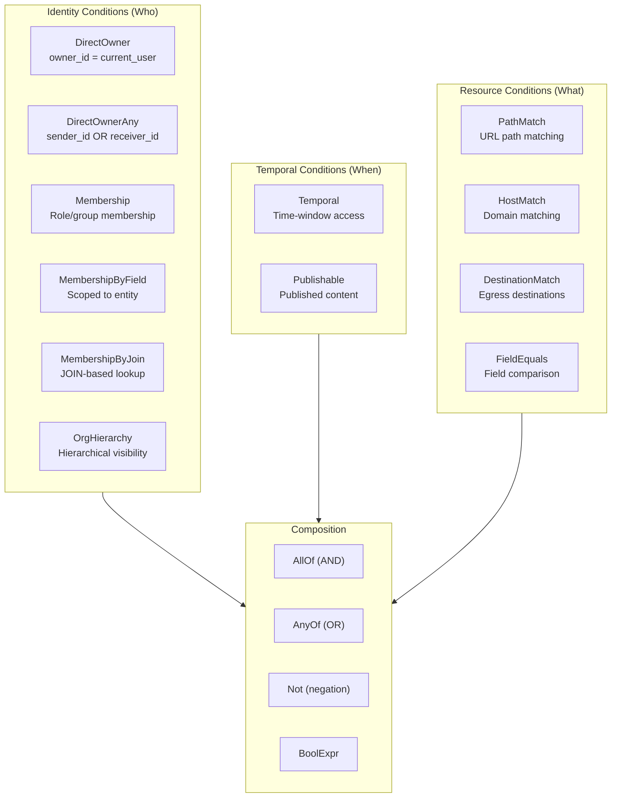

# Safegres

<p align="center" width="100%">
  
</p>

<p align="center" width="100%">
  <a href="https://github.com/constructive-io/safegres/actions/workflows/ci.yml">
    
  </a>
</p>

**Safegres** is a unified security system that extends TypeScript-based policy evaluation across three security domains: PostgreSQL Row-Level Security (RLS), ingress (HTTP request filtering), and egress (outbound connection control). Define access rules once in TypeScript, compile to multiple targets.

## Architecture Overview



## Security Flow

The following diagram shows how safegres secures traffic at each layer:



## Condition Types

Safegres provides a rich set of condition types for expressing access control logic:



## Packages

| Package | Description |
|---------|-------------|
| [safegres](./packages/safegres) | Core unified types, conditions, obligations, and helpers |
| [policy-engine](./packages/policy-engine) | Runtime policy evaluation with deny-overrides strategy |
| [nginx-parser](./packages/nginx-parser) | Parse and generate Nginx configuration files |
| [docker-parser](./packages/docker-parser) | Parse Dockerfiles into AST with heterogeneous bash parsing |
| [bash-parser](./packages/bash-parser) | Parse bash/shell commands into AST |

## Quick Example

```typescript
import { 
  createPolicy, 
  createRule, 
  postgresTarget,
  directOwner,
  membershipByField,
  publishable,
  anyOf
} from 'safegres';

// Define a policy for the posts table
const postsPolicy = createPolicy({
  id: 'posts.access',
  version: '1.0.0',
  description: 'Access control for blog posts',
  target: postgresTarget('public', 'posts'),
  rules: [
    // Owners have full access to their posts
    createRule({
      name: 'owner_access',
      actors: ['authenticated'],
      actions: ['select', 'insert', 'update', 'delete'],
      condition: directOwner('owner_id'),
      effect: 'allow'
    }),
    
    // Organization members can read posts
    createRule({
      name: 'org_member_read',
      actors: ['authenticated'],
      actions: ['select'],
      condition: membershipByField('org_id', 'Organization Member'),
      effect: 'allow'
    }),
    
    // Published posts are publicly readable
    createRule({
      name: 'public_read',
      actors: ['anonymous', 'authenticated'],
      actions: ['select'],
      condition: publishable('is_published'),
      effect: 'allow'
    })
  ]
});
```

## Getting Started

```sh
# Install dependencies
pnpm install

# Build all packages
pnpm build

# Run tests
pnpm test
```

### Prerequisites

- Node.js 20+
- pnpm

## Design Principles

1. **Single Source of Truth**: Define access rules once, compile to multiple targets
2. **Intent-Based**: Rules describe business intent, not implementation details
3. **Composable**: Conditions combine with AND/OR/NOT logic
4. **Type-Safe**: Full TypeScript type definitions for all constructs
5. **Deterministic**: Pure functions with no side effects during evaluation
6. **Auditable**: Clear mapping from business rules to technical implementation

## Roadmap

- [x] Phase 1: Core unified types and helpers (safegres package)
- [ ] Phase 2: Condition evaluator and policy validator
- [ ] Phase 3: PostgreSQL RLS compiler (safegres-postgres)
- [ ] Phase 4: Nginx compiler (safegres-nginx)
- [ ] Phase 5: Integration testing and benchmarks

## Credits

Built by the [Constructive](https://constructive.io) team.

## License

All Rights Reserved, Interweb, Inc.

## Disclaimer

AS DESCRIBED IN THE LICENSES, THE SOFTWARE IS PROVIDED "AS IS", AT YOUR OWN RISK, AND WITHOUT WARRANTIES OF ANY KIND.

No developer or entity involved in creating this software will be liable for any claims or damages whatsoever associated with your use, inability to use, or your interaction with other users of the code, including any direct, indirect, incidental, special, exemplary, punitive or consequential damages, or loss of profits, cryptocurrencies, tokens, or anything else of value.
